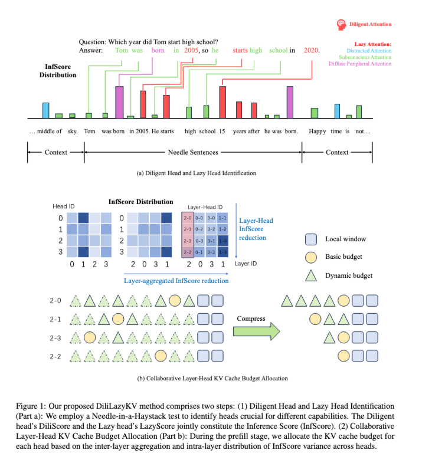

# 🥰 DiliLazyKV

DiliLazyKV is a novel two-stage KV cache compression library for KV Cache compression.



##  💻 Install Packages
Please see requirements.txt.

##  🚗 Two-stage method

###  🏃‍♀️‍➡️ Diligent Head and Lazy Head Identification

In the first stage, we identify the Inference score of individual attention heads for different model capabilities using a Needle-in-a-Haystack test. This test helps us distinguish between:

- Diligent Heads: These heads are crucial for processing task-relevant information and exhibit a high DiliScore, indicating their importance for accurate inference.
- Lazy Heads: These heads tend to focus on less critical or potentially redundant information and are characterized by a high LazyScore.
The Inference Score (InfScore) is then derived by jointly considering the DiliScore and LazyScore of each head, providing a comprehensive measure of its overall contribution to the model's reasoning abilities.

Run the obtaining InfScore script: We calculate multiple metrics, including the weighted DiliScore based on attention weights, the weighted LazyScore, and their harmonic mean - the weighted InfScore, to quantify the attention of each head to the "needle".

| #  | Question                                                | Needle                                                                           | Answer                                 |
|----|---------------------------------------------------------|----------------------------------------------------------------------------------|----------------------------------------|
| 1  | What are good ways to spend time in campus?             | The good ways to spend time in campus include relax and do nothing.              | Relax and do nothing.                  |
| 2  | What habits are beneficial for health during Ph.D. career? | The beneficial habits during Ph.D. career contain exercise and healthy diet.      | Exercise and healthy diet.             |
| 3  | Which year did Tom start high school?                   | Tom was born in 2005. Tom started high school fifteen years after he was born.   | Tom started high school in 2020.       |

At the same time, it also counts each head's 
- Diligent Attention (Top-K attention in the "needle")
- Subconscious Attention (non-Top-K attention in the "needle")
-  Distracted Attention (Top-K attention outside the "needle")
-  Diffuse Peripheral Attention (non-Top-K attention outside the "needle")

and other metrics based on the user-defined Top-K attention threshold and the position of the "needle". Only when the semantic similarity of the answer exceeds a threshold (such as 0.2 set in the script), the attention head scores of the corresponding test will be accumulated for the final head importance evaluation.

| Argument            | Description                                                                                                         |
|---------------------|---------------------------------------------------------------------------------------------------------------------|
| `--model_path`      | Path to a local LLM checkpoint or the model identifier on Hugging Face Hub (e.g. `llama-3-8b-instruct`).             |
| `--haystack_dir`    | Directory containing background text files (`.txt`). These files form the “haystack” corpus for the search task.     |
| `--min_len`         | Minimum context length (in tokens) to test.                                                                          |
| `--max_len`         | Maximum context length (in tokens) to test.                                                                          |
| `--context_intervals` | Number of evenly spaced context‐length intervals between `min_len` and `max_len`.                                      |
| `--gpu`             | GPU device ID to use (e.g. `0`, `1`). Defaults to CPU if omitted.                                                   |
| `--top_k_infscore`  | K value for “Top-K” selection when computing InfScore (the number of top-scoring tokens to consider).                |
| `--depths`          | Comma-separated list of percentage depths (e.g. `0.1,0.5,0.9`) at which to insert the “needle” into the haystack.     |

```python
python structure_head_InfScore.py 
```

### 🏃‍♂️ Collaborative Layer-Head KV Cache Budget Allocation

During the prefill stage, we allocate the KV cache budget for
each head based on the inter-layer aggregation and intra-layer distribution of InfScore variance across heads, , taking into account:

- Inter-layer Aggregation of InfScore Variance: We analyze how the variance of InfScores aggregates across different layers to understand the overall importance of head patterns within the network.
- Intra-layer Distribution of InfScore Variance: Within each layer, we examine the distribution of InfScore variance across different heads to identify the relative importance of individual heads.

By considering both layer-level and head-level information, DiliLazyKV dynamically assigns larger KV cache budgets to heads that contribute more significantly to inference performance and smaller budgets to less critical heads.

```
max_capacity_prompts=128

devices=(0 1) 
head_choices=('reason') #  copy, reason
betas=(1.351) 
counter=0
for((i=0;i<${#head_choices[@]};i++));do 
    for((j=0;j<${#betas[@]};j++));do # This loop will also run once as betas has 1 element
        device=${devices[counter]}
        head_choice=${head_choices[i]}
        beta=${betas[j]}
        temp=1
        nohup bash head_base.sh \
            $device \
            ReasonKV \
            ${max_capacity_prompts} \
            flash_attention_2 \
            meta-llama/Meta-Llama-3-8B-Instruct \
            $head_choice \
            $beta \
            $temp > ./longbench_logs/llama3_ReasoniKV_${head_choice}_base${max_capacity_prompts}_beta${beta}_temp${temp}.txt 2>&1 &
        ((counter+=1))
    done
done
```
## 🥳 Key Features and Benefits
- Two-Stage Compression: Separates head importance identification from budget allocation for a more principled approach.
- Diligent and Lazy Head Distinction: Leverages the varying roles of attention heads for targeted compression.
- Collaborative Layer-Head Allocation: Considers both layer-level and head-level importance for fine-grained budget management.
- Balances Compression and Performance: Achieves significant KV cache reduction while maintaining high inference accuracy.
- Enhanced Robustness: Demonstrates stable performance across different tasks and resource constraints.
- Beneficial for Real-World Deployment: Enables efficient deployment of large language models with reduced memory footprint and bandwidth requirements.

## 👏 Acknowledgement
Thanks [HeadKV-R2](https://github.com/FYYFU/HeadKV) for providing open-source code and data, which has been invaluable to the development of DiliLazyKV.
